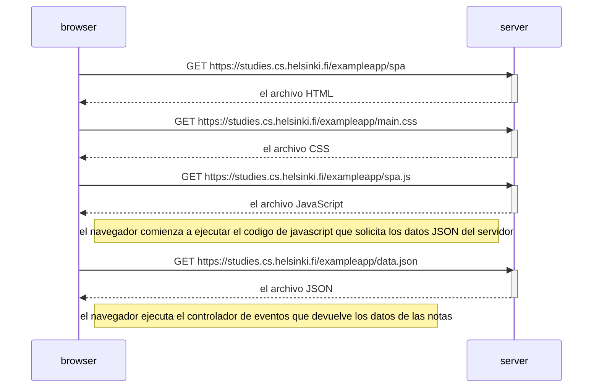

```mermaid
sequenceDiagram
    participant browser
    participant server

    browser->>server: GET https://studies.cs.helsinki.fi/exampleapp/spa
    activate server
    server-->>browser: el archivo HTML
    deactivate server

    browser->>server: GET https://studies.cs.helsinki.fi/exampleapp/main.css
    activate server
    server-->>browser: el archivo CSS
    deactivate server

    browser->>server: GET https://studies.cs.helsinki.fi/exampleapp/spa.js
    activate server
    server-->>browser: el archivo JavaScript
    deactivate server

    Note right of browser: el navegador comienza a ejecutar el codigo de javascript que solicita los datos JSON del servidor

    browser->>server: GET https://studies.cs.helsinki.fi/exampleapp/data.json
    activate server
    server-->>browser: el archivo JSON
    deactivate server

    Note right of browser: el navegador ejecuta el controlador de eventos que devuelve los datos de las notas

```