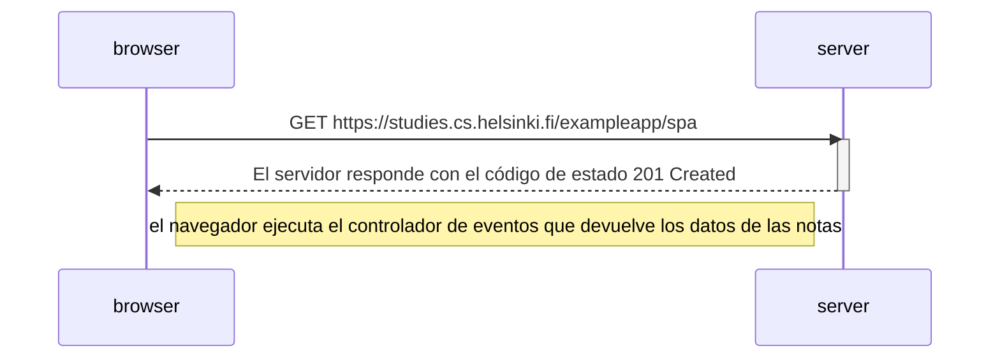

```mermaid
sequenceDiagram
    participant browser
    participant server

    browser->>server: GET https://studies.cs.helsinki.fi/exampleapp/spa
    activate server
    server-->>browser: El servidor responde con el código de estado 201 Created
    deactivate server

    Note right of browser: el navegador ejecuta el controlador de eventos que devuelve los datos de las notas

```